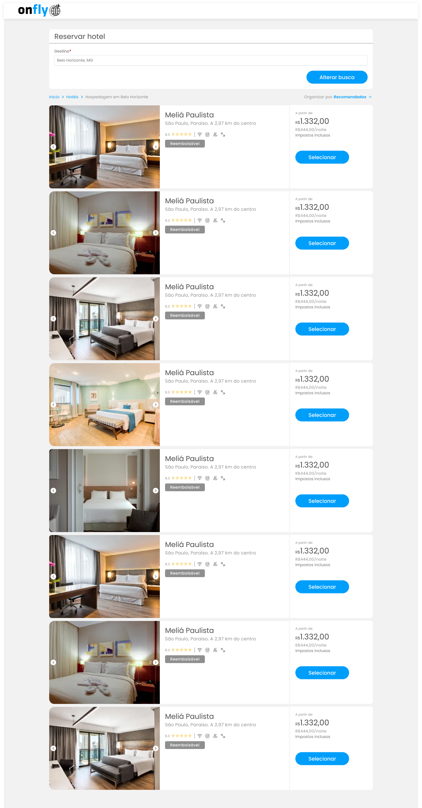
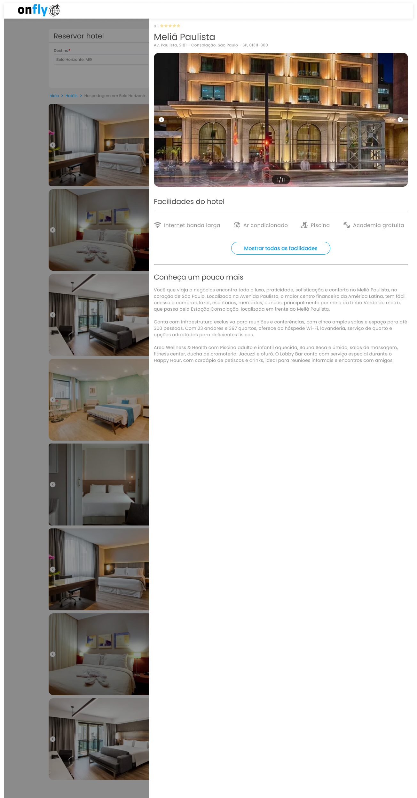

# Front-end Challenge - Onfly 20231205

## Introdução

Este é o nosso case técnico para Front-end! A ideia é que você possa mostrar toda sua expertise técnica através dele :D
Estamos animados para te ver brilhar novamente!

[SPOILER] As instruções de entrega e apresentação do challenge estão no final deste Readme (=

### Antes de começar

- Prepare o projeto para ser disponibilizado no Github, copiando o conteúdo deste repositório para o seu (ou utilize o fork do projeto e aponte para o Github). Confirme que a visibilidade do projeto é pública (não esqueça de colocar no readme a referência a este challenge);
- O projeto deve utilizar a Linguagem específica na sua Vaga (caso esteja se candidatando). Por exempo: Vue.js, Quasar e entre outras;
- Considere como *deadline 5 dias a partir do início do desafio*. Caso tenha sido convidado a realizar o teste e não seja possível concluir dentro deste período, avise a pessoa que o convidou para receber instruções sobre o que fazer.
- Documentar todo o processo de investigação para o desenvolvimento da atividade (README.md no seu repositório); os resultados destas tarefas são tão importantes do que o seu processo de pensamento e decisões à medida que as completa, por isso tente documentar e apresentar os seus hipóteses e decisões na medida do possível.

### Instruções iniciais obrigatórias

- Utilizar o framework Vue.js (opte pela versão que preferir)
- Utilizar o framework Quasar para a UI (pode usar outros, porém, conta muito para nós usar o Quasar ) ♥
- Utilizar classes para os dados.
- Seguir o protótipo da tela
- Busca de **Destinos** com **autocomplete**
- Filtros de ordenação aplicáveis a listagem (**Recomendados** e **Melhor Avaliados**)
  - Filtro por **Nome** será considerado um **diferencial** no seu teste!
- Scroll infinito (ao chegar no final da página, carregar mais 10 itens)

### Será um enorme **diferencial** para a gente se você: 
- Optar por usar **TypeScript**.
- Aplicar **Testes Unitários** em Componentes.

### Instruções

Vamos disponibilizar para você dois JSONs como fonte de dados. 

- Um será o [place.json](./assets/place.json), que contém as informações de 5 cidades brasileiras. 
- O segundo será o [hotel.json](./assets/hotel.json), nele está o relacionamento cidade versus hotéis.

Também iremos disponibilizar o protótipo da tela que você deverá nos entregar.

### Listagem

#### Formulário
- O campo Destinos deverá listar as opções no formato 'Belo Horizonte, Minas Gerais'. Quando selecionada uma opção, ela deverá ser exibida como 'Belo Horizonte, BH'.
- O botão deverá exibir 'Buscar' quando a busca estiver vazia e 'Alterar Busca' quando já tiver sido efetuado uma pesquisa.

#### Filtros
- Desenvolva o filtro Recomendados que deverá ordenar os hotéis pelo preço. Desenvolva o filtro Melhor Avaliados que deverá ordenar os hotéis pelo número de estrelas.

#### Listagem
- Apresente as imagens do hotel em um carrossel.
- Ao chegar no final da página, carregue mais 10 hotéis. Informe quando não há hotéis para listar.

#### Drawer
- Crie um drawer com as informações detalhadas hotel.
- Utilize novamente um carrossel para exibir as imagens do hotel e agora será necessário mostrar um contador dessas imagens.

## Readme do Repositório

- Deve conter o título do projeto
- Uma descrição sobre o projeto em frase
- Deve conter uma lista com linguagem, framework e/ou tecnologias usadas
- Como instalar e usar o projeto (instruções)
- Não esqueça o [.gitignore](https://www.toptal.com/developers/gitignore)
- Se está usando github pessoal, referencie que é um challenge by coodesh:

>  This is a challenge by [Coodesh](https://coodesh.com/)

## Finalização e Instruções para a Apresentação

Avisar sobre a finalização e enviar para correção.

1. Confira se você respondeu o Scorecard da Vaga que chegou no seu email;
2. Confira se você respondeu o Mapeamento Comportamental que chegou no seu email;
3. Acesse: [https://coodesh.com/challenges/review](https://coodesh.com/challenges/review);
4. Adicione o repositório com a sua solução;
5. Grave um vídeo, utilizando o botão na tela de solicitar revisão da Coodesh, com no máximo 5 minutos, com a apresentação do seu projeto. Foque em pontos obrigatórios e diferenciais quando for apresentar.
6. Adicione o link da apresentação do seu projeto no README.md.
7. Verifique se o Readme está bom e faça o commit final em seu repositório;
8. Confira a vaga desejada;
9. Envie e aguarde as instruções para seguir no processo. Sucesso e boa sorte. =)

## Suporte

Use o nosso canal no slack: http://bit.ly/32CuOMy para tirar dúvidas sobre o processo ou envie um e-mail para contato@coodesh.com.

